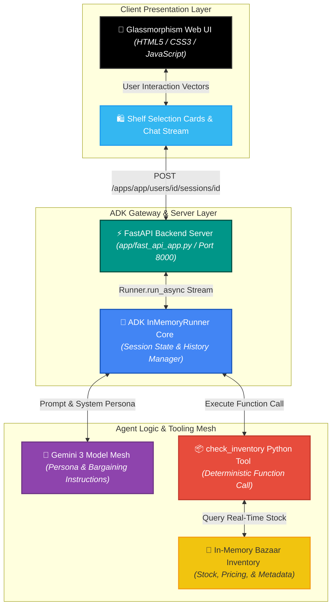

<div align="center">


# 👳‍♂️ Raju's Royal Artifacts

### Enterprise-Grade Conversational Bargaining Agent, Real-Time Function Calling & Google ADK Runtime Architecture

**Raju's Royal Artifacts** is an interactive, stateful conversational AI bazaar agent engineered with **Google's Agent Development Kit (ADK)** and powered by **Google Gemini**. Operating as a witty, theatrical Indian shopkeeper, the agent leverages deterministic Python function calling (`check_inventory`) alongside system prompt constraints to dynamically inspect live inventory quantities, negotiate prices against lowball offers, and decline out-of-stock items in real time.

<p align="center">
  
  
  
  
  
</p>

<p align="center">
  <a href="https://github.com/shreeharsh-patil/raju-shop/stargazers"></a>
  <a href="https://github.com/shreeharsh-patil/raju-shop/issues"></a>
  <a href="LICENSE"></a>
</p>

[**Explore Codelab**](https://codelabs.developers.google.com/agentic-app-gemini-3-adk) • [**Live Demo UI**](#-quick-start-guide) • [**API Reference**](#-api-reference)

---

</div>

## 📖 Overview

Welcome to **Raju's Royal Artifacts**, an interactive digital bazaar where an autonomous AI agent acts as a charismatic, dramatic shopkeeper. Developed as an implementation of the official Google Cloud Codelab: **[Build your own "Bargaining Shopkeeper" Agent with Gemini 3 and ADK](https://codelabs.developers.google.com/agentic-app-gemini-3-adk)**, Raju blends real-time function calling tools with persona constraints to inspect in-memory inventory datasets, counter lowball customer bids, and manage out-of-stock items dynamically.

---

## 🏛️ System Architecture & Agent Runtime Topology

Standard single-prompt LLM chatbots hallucinate product stock levels and fail to adhere to transactional pricing rules. 

**Raju's Royal Artifacts** resolves this through an **ADK-Orchestrated Function Calling Topology**. The client communicates over CORS-enabled FastAPI endpoints to the `google.adk.runners.InMemoryRunner`. When a user inquires about or bids on an item, the runner invokes the deterministic `check_inventory` Python tool before returning the prompt context to Gemini, grounding the response directly in live inventory records.



> [!NOTE]
> **Stateful Session Isolation**: The InMemoryRunner maintains dedicated multi-turn conversation contexts per userId and sessionId, ensuring that negotiated prices and prior counter-offers persist throughout the bargaining session.

### 🔄 End-to-End Bargaining & Tool Execution Lifecycle

The sequence blueprint below shows the complete lifecycle of a user interaction, from price negotiation to function call execution, stock validation, and agent response synthesis:

```mermaid
sequenceDiagram
    autonumber
    actor Customer as 👤 Customer / Browser
    participant UI as Glassmorphism Frontend
    participant API as FastAPI ADK Gateway
    participant RUN as ADK InMemoryRunner
    participant GEM as Gemini 3 Model
    participant TOOL as check_inventory Tool
    participant DB as In-Memory Inventory

    Customer->>UI: Select Item & Offer Bid ("I'll give you 20 coins for the Brass Lamp")
    UI->>API: POST /run (Payload: userId, sessionId, prompt)
    API->>RUN: Dispatch async turn event
    RUN->>GEM: Send User Turn + System Instructions
    
    rect rgb(30, 20, 40)
        note over GEM,TOOL: Function Calling Window
        GEM-->>RUN: Emit Tool Call Intent (`check_inventory(item_name="Brass Lamp")`)
        RUN->>TOOL: Execute Python function call
        TOOL->>DB: Query stock quantity and listed price
        DB-->>TOOL: Return `{ price: 50, stock: 5, status: "in_stock" }`
        TOOL-->>RUN: Return Tool Output Payload
        RUN->>GEM: Inject Tool Result Context
    end

    GEM->>GEM: Synthesize Persona Response (Counter-offer high, witty banter)
    GEM-->>RUN: Yield Formatted Model Text ("Arre my friend! 20 coins is daylight robbery! How about 40?")
    RUN-->>API: Stream Formatted ADK Response Content
    API-->>UI: Return HTTP 200 OK JSON
    UI-->>Customer: Render Dramatic Shopkeeper Dialogue & Update Chat
```



### 🛠️ Production Pipeline Implementation

| Pipeline Component | Technical Challenge | Enterprise Engineering Solution |
| :--- | :--- | :--- |
| 🎭 Persona Constraint | LLMs drift out of character or accept arbitrary user price overrides without negotiation. | Enforces strict system instructions inside `agent.py` compelling Raju to defend margins and use witty Indian-English vernacular. |
| 📦 Function Grounding | Quoting out-of-date prices or promising sold-out items to customers. | Binds the model directly to the `check_inventory` tool, forcing tool execution before price confirmation or rejection. |
| ⚡ Fast Session Turns | Rebuilding tool context graphs on every request introduces runtime latency. | Uses `google.adk.runners.InMemoryRunner` within an asynchronous FastAPI loop for sub-second turn latency. |
| 🎨 Responsive Bazaar UI | Presenting multi-turn negotiations and inventory cards cleanly across devices. | Delivers a responsive glassmorphic UI with quick-select item chips, dynamic typing indicators, and stateful session reset triggers. |

---

## 📦 Bazaar Shelf Inventory

| Item Icon | Item Name | Listed Price | Stock Status | Availability |
| :---: | :--- | :---: | :---: | :---: |
| 🪔 | **Brass Lamp** | 50 Coins | 5 Units | 🟢 In Stock |
| 🧣 | **Silk Scarf** | 500 Coins | 2 Units | 🟢 In Stock |
| 🕌 | **Taj Mahal** | 2000 Coins | 0 Units | 🔴 **SOLD OUT** |

---

## 🎨 Interface Showcase

*(Add screenshots of the UI here)*

---

## 🚀 Deployment & Quick Start Guide

### Prerequisites

- **Runtime Sandbox**: Python >= 3.10
- **API Credentials**: Google Gemini API Key from [Google AI Studio](https://aistudio.google.com/)

### 🚀 Option A: Automated Single-Command Setup (Recommended)

Run the automated setup script to verify Python, configure your environment, install dependencies, execute test suites, and launch the server:

#### 🪟 Windows (PowerShell)

```powershell
.\run_setup.ps1
```

#### 🐧 Linux & 🍎 macOS (Bash / Zsh)

```bash
chmod +x run_setup.sh
./run_setup.sh
```

### 🛠️ Option B: Step-by-Step Manual Setup

**Windows (PowerShell):**

```powershell
# 1. Clone & enter project folder
git clone https://github.com/shreeharsh-patil/raju-shop.git
cd raju-shop

# 2. Create and activate virtual environment
python -m venv .venv
.\.venv\Scripts\Activate.ps1

# 3. Install project dependencies
pip install -r requirements.txt

# 4. Export Gemini API Key
$env:GEMINI_API_KEY="your_actual_gemini_api_key_here"

# 5. Launch FastAPI development server
$env:PYTHONPATH="."
python -m uvicorn app.fast_api_app:app --host 127.0.0.1 --port 8000 --reload
```

**Linux / macOS (Bash):**

```bash
# 1. Clone & enter project folder
git clone https://github.com/shreeharsh-patil/raju-shop.git
cd raju-shop

# 2. Create and activate virtual environment
python3 -m venv .venv
source .venv/bin/activate

# 3. Install project dependencies
pip install -r requirements.txt

# 4. Export Gemini API Key
export GEMINI_API_KEY="your_actual_gemini_api_key_here"

# 5. Launch FastAPI development server
export PYTHONPATH="."
python3 -m uvicorn app.fast_api_app:app --host 0.0.0.0 --port 8000 --reload
```

Access the Bazaar UI at: 👉 **http://localhost:8000**

---

## 🧪 Automated Testing & Validation

Execute the unit test suite with pytest to verify agent initialization, tool execution, and out-of-stock logic:

```bash
# Windows
$env:PYTHONPATH="."
python -m pytest tests/test_agent.py -v

# Linux / macOS
export PYTHONPATH="."
python3 -m pytest tests/test_agent.py -v
```

---

## 🔌 API Reference

### POST /apps/app/users/{user_id}/sessions/{session_id} — Initialize Session

**Response**:

```json
{
  "userId": "user1",
  "sessionId": "session1",
  "status": "initialized",
  "message": "Session created successfully"
}
```

### POST /run — Execute Agent Turn

**Request Payload**:

```json
{
  "appName": "app",
  "userId": "user1",
  "sessionId": "session1",
  "newMessage": {
    "role": "user",
    "parts": [{ "text": "Do you have any Taj Mahals in stock?" }]
  }
}
```

**Response Payload**:

```json
{
  "appName": "app",
  "userId": "user1",
  "sessionId": "session1",
  "content": {
    "role": "model",
    "parts": [
      {
        "text": "Arre my friend! The Taj Mahal is OUT OF STOCK! Stock is zero! Perhaps consider a Brass Lamp?"
      }
    ]
  }
}
```

---

## 📁 Repository Directory Structure

```text
raju-shop/
├─ assets/                          (Project branding, banners, and screenshots)
│  └─ banner.png                    (README hero banner graphic)
├─ app/                             (Core Application Logic & ADK Server)
│  ├─ __init__.py                   (Package namespace marker)
│  ├─ agent.py                      (Raju persona, system prompt, and check_inventory tool)
│  └─ fast_api_app.py               (ADK FastAPI runner server and route endpoints)
├─ tests/                           (Automated Testing Suites)
│  └─ test_agent.py                 (Pytest suite testing inventory tools & agent turns)
├─ index.html                       (Interactive Glassmorphic Web Presentation UI)
├─ pyproject.toml                   (Project configuration and packaging metadata)
├─ requirements.txt                 (Python runtime dependency manifest)
├─ run_setup.ps1                    (Windows All-in-One automation setup script)
├─ run_setup.sh                     (Linux/macOS All-in-One automation setup script)
└─ README.md                        (Unified platform documentation)
```

---

## 📜 Credits & License

- Built based on the official Google Cloud Codelab: [Build your own "Bargaining Shopkeeper" Agent with Gemini 3 and ADK](https://codelabs.developers.google.com/agentic-app-gemini-3-adk).
- Framework powered by the [Google Agent Development Kit (ADK)](https://google.github.io/adk-docs/).
- Open-source and distributed under the **MIT License**.

### 👤 Project Author

Developed and Maintained by **Shreeharsh Patil**.

Feel free to contact me or submit issues via:
- **Email**: shreeharsh.dev@gmail.com
- **GitHub Profile**: [github.com/shreeharsh-patil](https://github.com/shreeharsh-patil)
