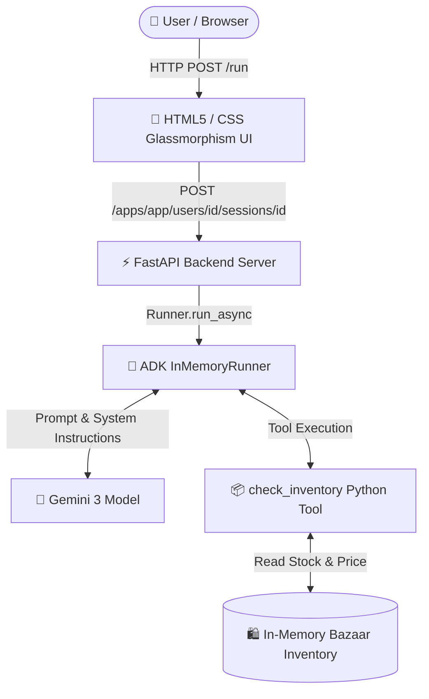

<div align="center">


# 👳‍♂️ Raju's Royal Artifacts
### *AI-Powered Bargaining Shopkeeper Agent with Gemini & ADK*

[](https://www.python.org/)
[](https://ai.google.dev/)
[](https://google.github.io/adk-docs/)
[](https://fastapi.tiangolo.com/)
[](LICENSE)

[**Explore Codelab**](https://codelabs.developers.google.com/agentic-app-gemini-3-adk) • [**Live Demo UI**](#-quick-start-guide) • [**API Reference**](#-api-reference)

---

</div>

## 📖 Overview

Welcome to **Raju's Royal Artifacts**, an interactive digital bazaar where an AI agent acts as a witty, dramatic shopkeeper! Built using **Google's Agent Development Kit (ADK)** and powered by **Gemini**, Raju inspects real-time inventory using function calling and negotiates prices with customers.

> [!NOTE]
> This application implements the official Google Cloud Codelab: **[Build your own "Bargaining Shopkeeper" Agent with Gemini 3 and ADK](https://codelabs.developers.google.com/agentic-app-gemini-3-adk)**.

---

## ✨ Features

- 🎭 **Dynamic Bargaining Persona**: Raju speaks with an Indian-English shopkeeper flair ("*Arre my friend!*", "*Wah! Special price for you!*"), selling high and countering lowball offers.
- 🛠️ **Real-Time Function Calling**: Connected to a custom Python `check_inventory` tool to query live stock and pricing data.
- 🚫 **Out-of-Stock Handling**: Dramatically declines sales when stock is zero (e.g. Taj Mahal).
- ⚡ **ADK FastAPI Runtime**: Built with `google.adk.runners.InMemoryRunner` with CORS support and stateful sessions.
- 🎨 **Glassmorphism Web UI**: Vibrant Indian bazaar aesthetic featuring shelf selection cards, character avatar, typing indicator, and responsive chat.
- 🌍 **Cross-Platform**: Fully compatible with **Windows**, **Linux**, and **macOS**.

---

## 🏛️ System Architecture



---

## 📦 Bazaar Shelf Inventory

| Item Icon | Item Name | Listed Price | Stock Status | Availability |
| :---: | :--- | :---: | :---: | :---: |
| 🪔 | **Brass Lamp** | 50 Coins | 5 Units | 🟢 In Stock |
| 🧣 | **Silk Scarf** | 500 Coins | 2 Units | 🟢 In Stock |
| 🕌 | **Taj Mahal** | 2000 Coins | 0 Units | 🔴 **SOLD OUT** |

---

## 📋 Prerequisites

Before running the project, ensure you have:

1. **Python 3.10+** installed ([python.org](https://www.python.org/downloads/)).
2. **Gemini API Key** from [Google AI Studio](https://aistudio.google.com/).

---

## ⚡ Quick Start Guide

### 🚀 Option A: Automated Single-Command Setup (Recommended)

Run the automated setup script to check Python, set your API key, build `.venv`, install packages, run tests, and launch the web server!

#### 🪟 Windows (PowerShell)
```powershell
.\run_setup.ps1
```

#### 🐧 Linux & 🍎 macOS (Bash / Zsh)
```bash
chmod +x run_setup.sh
./run_setup.sh
```

---

### 🛠️ Option B: Step-by-Step Manual Setup

<details>
<summary><b>Click to expand Windows (PowerShell) Manual Steps</b></summary>

```powershell
# 1. Navigate to project folder
cd raju-shop

# 2. Create and activate virtual environment
python -m venv .venv
.\.venv\Scripts\Activate.ps1

# 3. Install dependencies
pip install -r requirements.txt

# 4. Set Gemini API Key
$env:GEMINI_API_KEY="your_actual_gemini_api_key_here"

# 5. Launch FastAPI server
$env:PYTHONPATH="."
python -m uvicorn app.fast_api_app:app --host 127.0.0.1 --port 8000 --reload
```
</details>

<details>
<summary><b>Click to expand Linux & macOS (Bash) Manual Steps</b></summary>

```bash
# 1. Navigate to project folder
cd raju-shop

# 2. Create and activate virtual environment
python3 -m venv .venv
source .venv/bin/activate

# 3. Install dependencies
pip install -r requirements.txt

# 4. Set Gemini API Key
export GEMINI_API_KEY="your_actual_gemini_api_key_here"

# 5. Launch FastAPI server
export PYTHONPATH="."
python3 -m uvicorn app.fast_api_app:app --host 0.0.0.0 --port 8000 --reload
```
</details>

Once launched, open your web browser at:
👉 **`http://localhost:8000`**

---

## 🧪 Automated Testing

Verify the agent and tool logic with `pytest`:

**Windows**:
```powershell
$env:PYTHONPATH="."
python -m pytest tests/test_agent.py
```

**Linux / macOS**:
```bash
export PYTHONPATH="."
python3 -m pytest tests/test_agent.py
```

---

## 📁 Directory Structure

```text
raju-shop/
├── assets/
│   └── banner.png          # README Hero Banner Image
├── app/
│   ├── __init__.py
│   ├── agent.py            # Raju persona, system prompt & check_inventory tool
│   └── fast_api_app.py     # ADK FastAPI runner server
├── tests/
│   └── test_agent.py       # Pytest suite
├── index.html              # Interactive Glassmorphism Web UI
├── pyproject.toml          # Project configuration
├── requirements.txt        # Python dependency manifest
├── run_setup.ps1           # Windows All-in-One script
├── run_setup.sh            # Linux/macOS All-in-One script
└── README.md               # Project documentation
```

---

## 🔌 API Reference

<details>
<summary><b>POST /apps/app/users/{user_id}/sessions/{session_id} — Initialize Session</b></summary>

**Response**:
```json
{
  "userId": "user1",
  "sessionId": "session1",
  "status": "initialized",
  "message": "Session created successfully"
}
```
</details>

<details>
<summary><b>POST /run — Execute Agent Turn</b></summary>

**Request Payload**:
```json
{
  "appName": "app",
  "userId": "user1",
  "sessionId": "session1",
  "newMessage": {
    "role": "user",
    "parts": [{ "text": "Do you have any Taj Mahals in stock?" }]
  }
}
```

**Response Payload**:
```json
{
  "appName": "app",
  "userId": "user1",
  "sessionId": "session1",
  "content": {
    "role": "model",
    "parts": [
      {
        "text": "Arre my friend! The Taj Mahal is OUT OF STOCK! Stock is zero! Perhaps consider a Brass Lamp?"
      }
    ]
  }
}
```
</details>

---

## 📜 License & Credits

- Built based on [Google Cloud Codelabs](https://codelabs.developers.google.com/agentic-app-gemini-3-adk).
- Framework by [Google Agent Development Kit (ADK)](https://google.github.io/adk-docs/).
- Open-source under the **MIT License**.
